# Отображение иерархической структуры данных в WPF с помощью привязки и шаблонов

Источник: [Отображение иерархической структуры данных в WPF с помощью привязки и шаблонов / Хабр](https://habr.com/ru/post/94231/)

## Введение

Представление набора данных в виде иерархической структуры (любого уровня вложенности) в WPF осуществляется очень просто. Как правило, для этого используется класс System.Windows.Controls.TreeView и выглядит результат как-то так:

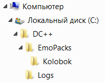

Я продемонстрирую два случая построения такого дерева, отличающихся друг от друга **источником данных**:

* База данных, размещённая на MS SQL Server 2008
* XML-файл.

В приложении будет реализована возможность динамической замены одного источника данных другим.
Прежде всего необходимо создать источники данных, из которых следует получать информацию. Такими источниками будут:

1. База данных **MyTestDb.mdf**
2. Xml-файл **XMLFile1.xml**

Будет создано единственное решение (Solution), состоящее из двух проектов (Projects):

1. **Linq2SqlProject** — библиотека, содержащая в себе набор классов, являющихся объектным проецированием реляционной структуры базы данных.
2. **WpfGuiProject** — графическая часть приложения (GUI), выполненная с применением технологии WPF. В этом же проекте будет размещён код, касающийся работы с XML-данными.

Взаимодействие со всеми рассматриваемыми в теме источниками данных будет реализовано с использованием технологии LINQ.

## 1. Создание базы данных

В нашем примере база данных будет состоять из двух таблиц — этого достаточно для демонстрации решения озвученной задачи:

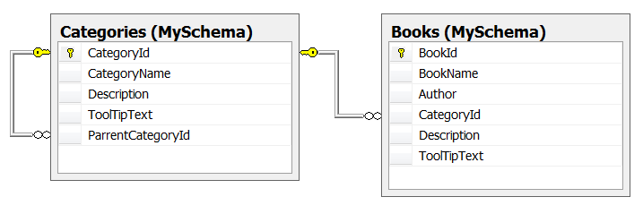

В таблицу MySchema.Categories я добавил следующие записи:

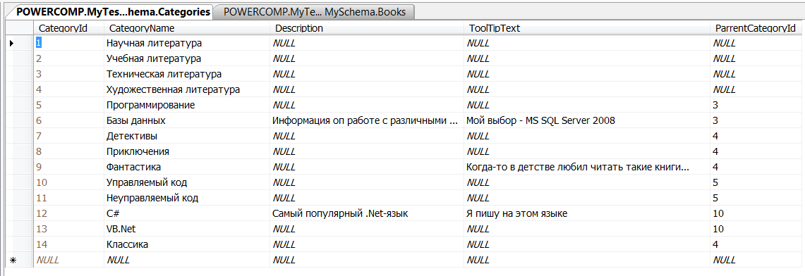

В таблицу MySchema.Books внесены такие данные:

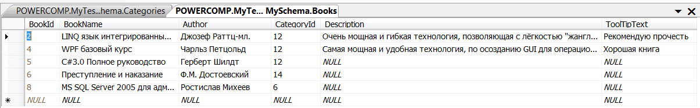

Дабы не усложнять пример, я не стану создавать в базе данных набор хранимых процедур, с помощью которых клиентское приложение должно было бы работать с БД (хотя в реальной работе, конечно же следует вести диалог с базой данных только через хранимые процедуры, дабы избежать возможности выполнения sql-инъекций).

Скачиваем выше указанную базу данных отсюда и подключаем её к нашей СУБД.

## 2. Создаём объектно-ориентированную проекцию базы данных

1. Создадим новое пустое решение (Solution), присвоив ему имя «TreeStructureBrowse»: 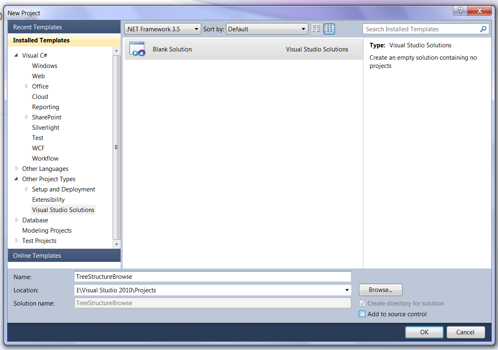
2. Из контекстного меню, полученного щелчком мышью по имени решения в Solution Explorer, выбираем пункт Add => New Project…
3. Выбираем тип проекта «Class Library» и назначаем нашему проекту имя «Linq2Sql», после чего жмём клавишу OK.
4. Из контекстного меню, полученного щелчком мышью по имени проекта, добавленного нами в п.3, выбираем пункт Add => New Item…
5. Выбираем элемент «LINQ to SQL Classes» и назначаем файлу имя «MyTestDb»: 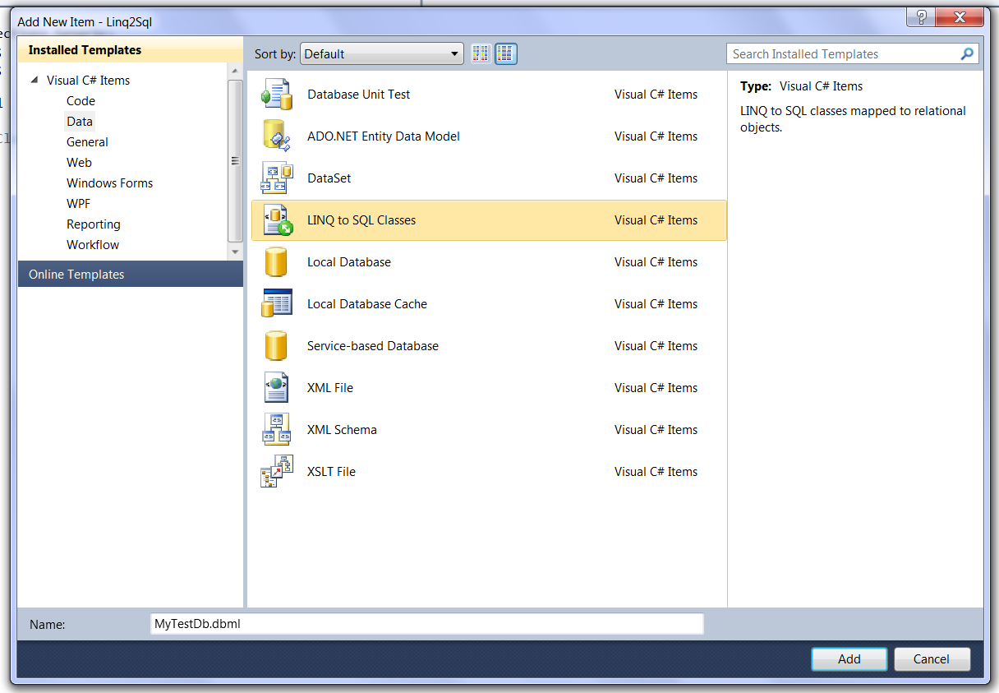
6. Из меню «View», выбираем пункт «Server Explorer». В появившемся окне нажимаем кнопку «Connect to Database»: 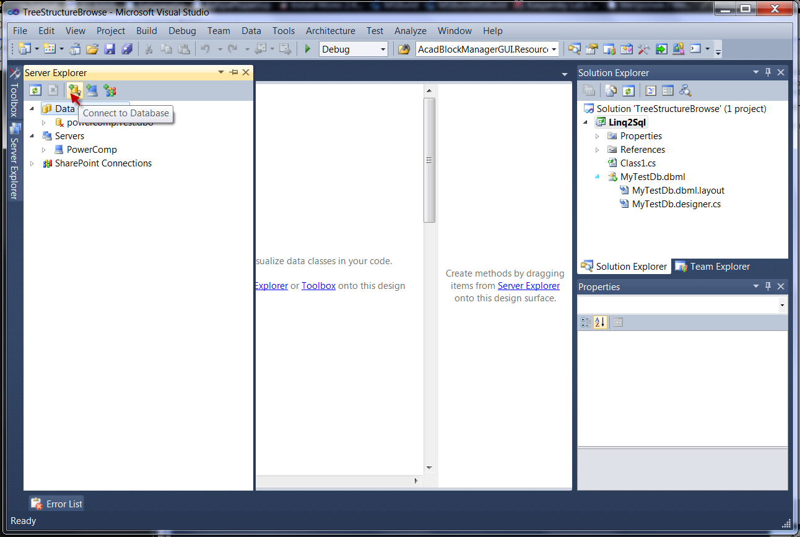
7. Указываем все необходимые параметры строки подключения (в моём случае используется аутентификация Windows): 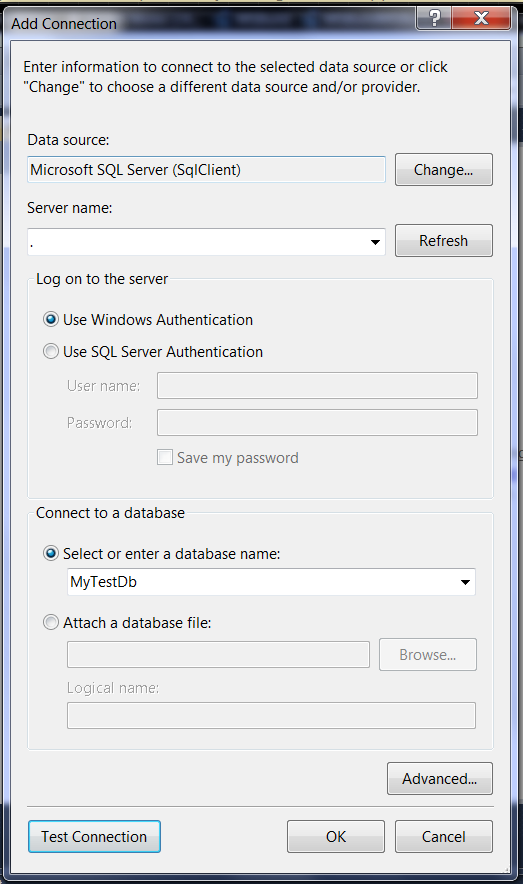
8. Жмём кнопку «Test Connection», дабы убедиться, что подключиться нам удастся, после чего нажатием кнопки ОК закрываем окно «Add Connection».
9. Теперь в окне «Server Explorer» мы увидим такую картину:\ 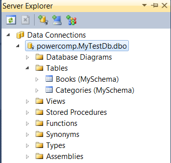\ p.s. **powercomp** — это имя моего компьютера
10. Удерживая нажатой клавишу Shift, выбираем обе наши таблицы (Books и Categories) и перетаскиваем их мышью на вкладку MyTestDb.dbml*, в результате чего получим следующую картину: 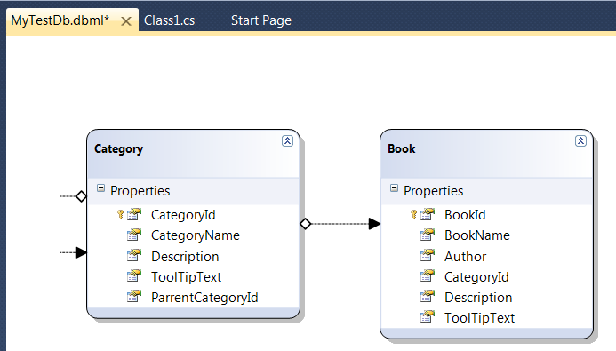
11. Сохраняем наш проект и выполняем команду Build => Rebuild Solution.

Т.о. мы только что создали объектно ориентированную модель нашей реляционной базы, что является первым ключевым моментом (из трёх) в решении нашей задачи.

## 3. Создание графической части (GUI), написание конвертеров и формирование шаблонов

1. В созданное нами в предыдущем разделе решение (Solution), добавим новый проект, задав ему имя WpfGuiProject: 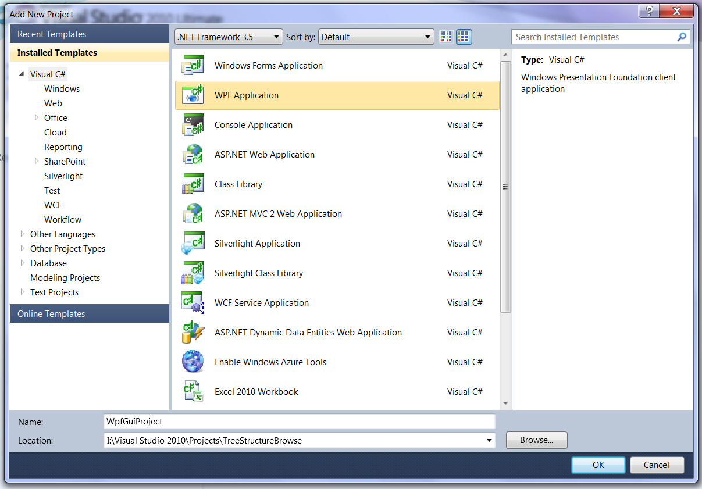
2. Из контекстного меню, вызванного нажатием правой кнопки мыши на имени только что добавленного в наше решение проекта, выбираем пункт «Set as StartUp Project», сделав тем самым GUI проект запускаемым по умолчанию.
3. Добавляем в проект «WpfGuiProject» ссылку на проект «Linq2Sql»: 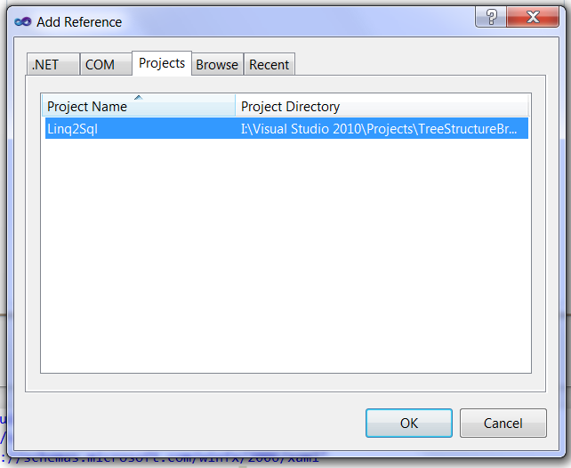
4. Добавляем в наш проект словарь ресурсов: из контекстного меню, вызванного нажатием правой кнопки мыши по имени нашего проекта, активируем пункт Add => Resource Dictionary… и в появившемся диалоговом окне выбираем одноимённый элемент: 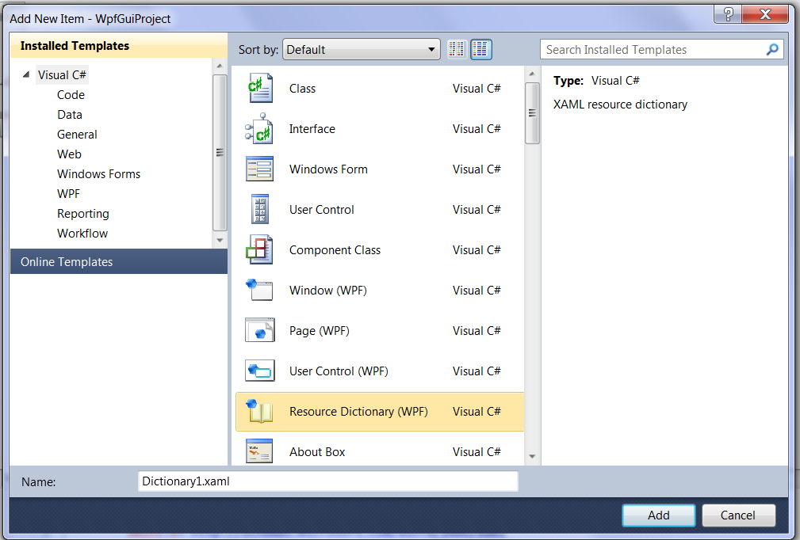
5. Через контекстное меню проекта добавляем в него новый файл типа «Class», назначив ему имя «MyConverters.cs».
6. Подключаем к нашему проекту сборку «System.Data.Linq».
7. В созданном в п.5 файле пишем такой код:
  ```csharp
using System;
using System.Collections.Generic;
using System.Linq;
using System.Text;
using System.Windows.Data;
using Linq2Sql;
using System.Xml.Linq;
 
namespace WpfGuiProject
{
  //Конвертер для класса Category. Задача этого конвертера - извлечение вложенных элементов типа Category.
  public sealed class CategoryValueConverter : IValueConverter
  {
 
    public object Convert(object value, Type targetType, object parameter, System.Globalization.CultureInfo culture)
    {
      if (value is Category)
      {
        Category x = (Category) value;
        return (x).Categories.Where(n => n.ParrentCategoryId == x.CategoryId).OrderBy(n => n.CategoryName);
      }
      else
      {
        return null;
      }
    }
    public object ConvertBack(object value, Type targetType, object parameter, System.Globalization.CultureInfo culture)
    {
      throw new NotImplementedException();
    }
  }
 
  //Конвертер для класса XElement. Задача этого конвертера - извлечение вложенных элементов типа XElement, инкапсулирующих
  //в себе разделы Category.
  public sealed class XmlConverter :IValueConverter
  {
 
    public object Convert(object value, Type targetType, object parameter, System.Globalization.CultureInfo culture)
    {
      if (value is XElement)
      {
        XElement x = (XElement)value;
        return x.Elements("Category");
      }
      else
      {
        return null;
      }
    }
    public object ConvertBack(object value, Type targetType, object parameter, System.Globalization.CultureInfo culture)
    {
      throw new NotImplementedException();
    }
  }
}
```
  Созданные в п.7 являются вторым (из трёх) ключевым моментом для решения стоящей перед нами задачи — иерархическое визуальное представление информации, реализованное при помощи привязки к данным. В коде мы определяем логику получения нужных нам дочерних элементов, которые должны участвовать в построении иерархической модели.
8. Редактируем файл «Dictionary1.xaml»:
  ```xml
<ResourceDictionary xmlns="http://schemas.microsoft.com/winfx/2006/xaml/presentation"
          xmlns:x="http://schemas.microsoft.com/winfx/2006/xaml"
          xmlns:linq2Xml="clr-namespace:System.Xml.Linq;assembly=System.Xml.Linq"
          xmlns:linq="clr-namespace:Linq2Sql;assembly=Linq2Sql"
          xmlns:local="clr-namespace:WpfGuiProject">
  <!--Шаблон иерархического отображения экземпляров класса TreeTable В СЛУЧАЕ ПОДКЛЮЧЕНИЯ К БАЗЕ ДАННЫХ-->
  <HierarchicalDataTemplate x:Key="key1" DataType="{x:Type linq:Category}">
    <!--Указываю источник данных, на основании которого должно формироваться дерево разделов-->
    <HierarchicalDataTemplate.ItemsSource>
      <Binding Path=".">
        <!--Указываю конвертер, который позволяет получить список дочерних элементов типа Category, по отношению к данному-->
        <Binding.Converter>
          <local:CategoryValueConverter/>
        </Binding.Converter>
      </Binding>
    </HierarchicalDataTemplate.ItemsSource>
    <!--Формирую визуальное представление элемента, отображаемого в дереве разделов-->
    <DockPanel>
      <TextBlock Text="{Binding Path=CategoryName}">
        <TextBlock.ToolTip>
          <Binding Path="Description"/>
        </TextBlock.ToolTip>
      </TextBlock>
      <!--Количество книг, размещённых непосредственно в разделе-->
      <TextBlock Name="txtLeft" Text=" (" Grid.Column="1"/>
      <TextBlock Name="txtCount" Text="{Binding Path=Books.Count}" Grid.Column="2"/>
      <TextBlock Name="txtRight" Text=")" Grid.Column="3"/>
    </DockPanel>
  </HierarchicalDataTemplate>
  <!--Шаблон отображения экземпляров класса Book В СЛУЧАЕ ПОДКЛЮЧЕНИЯ К БАЗЕ ДАННЫХ-->
  <DataTemplate DataType="{x:Type linq:Book}">   
    <TextBlock Text="{Binding Path=BookName}">
      <TextBlock.ToolTip>
        <Binding Path="ToolTipText"/>
      </TextBlock.ToolTip>
    </TextBlock>
  </DataTemplate>
 
  <!--Шаблон иерархического отображения данных В СЛУЧАЕ ПОДКЛЮЧЕНИЯ К XML-ФАЙЛУ -->
  <HierarchicalDataTemplate x:Key="key2" DataType="{x:Type linq2Xml:XElement}">
    <!--Указываю источник данных, на основании которого должно формироваться дерево разделов-->
    <HierarchicalDataTemplate.ItemsSource>
      <Binding Path=".">
        <!--Указываю конвертер, который позволяет получить список дочерних элементов типа Category, по отношению к данному-->
        <Binding.Converter>
          <local:XmlConverter/>
        </Binding.Converter>
      </Binding>
    </HierarchicalDataTemplate.ItemsSource>
    <!--Формирую визуальное представление элемента, отображаемого в дереве разделов-->
    <TextBlock Text="{Binding Path=Attribute[CategoryName].Value}">
        <TextBlock.ToolTip>
          <Binding Path="Attribute[ToolTipText].Value"/>
        </TextBlock.ToolTip>
    </TextBlock>
  </HierarchicalDataTemplate>
 
  <!--Шаблон отображения экземпляров класса Book В СЛУЧАЕ ПОДКЛЮЧЕНИЯ К XML-файлу -->
  <DataTemplate x:Key="key3" DataType="{x:Type linq2Xml:XElement}">
    <Grid>
      <Grid.RowDefinitions>
        <RowDefinition />
        <RowDefinition Height="Auto" />
      </Grid.RowDefinitions>
      <TextBlock Text="{Binding Path=Attribute[BookName].Value}">
        <TextBlock.ToolTip>
          <Binding Path="Attribute[ToolTipText].Value"/>
        </TextBlock.ToolTip>
      </TextBlock>
    </Grid>
  </DataTemplate>
</ResourceDictionary>
```

Xml-разметка, созданная в п.8 является третьим ключевым моментом. В данной разметке с помощью класса HierarchicalDataTemplate определены — шаблон отображения данных и конвертер, который следует использовать, для получения дочерних элементов по отношению к текущему.

Теперь начинаем формировать графическое представление нашего окна.

9. Редактируем содержимое файла «MainWindow.xaml»:

```xml
<Window x:Class="WpfGuiProject.MainWindow"
    xmlns="http://schemas.microsoft.com/winfx/2006/xaml/presentation"
    xmlns:x="http://schemas.microsoft.com/winfx/2006/xaml"
    xmlns:linq="clr-namespace:Linq2Sql;assembly=Linq2Sql"
    xmlns:local="clr-namespace:WpfGuiProject"
    Title="Иерархическое отображение данных с помощью привязки" Height="350" Width="525">
  <!--Подключаем файл ресурсов-->
  <Window.Resources>
    <ResourceDictionary>
      <ResourceDictionary.MergedDictionaries>
        <ResourceDictionary Source="Dictionary1.xaml"/>
      </ResourceDictionary.MergedDictionaries>
    </ResourceDictionary>
  </Window.Resources>
  <!--Формируем визуальное содержимое окна-->
  <Grid>
    <Grid.ColumnDefinitions>
      <ColumnDefinition Width="50*" />
      <ColumnDefinition Width="Auto" />
      <ColumnDefinition Width="50*" />
    </Grid.ColumnDefinitions>
    <Grid.RowDefinitions>
      <RowDefinition Height="Auto" />
      <RowDefinition Height="100*" />
      <RowDefinition Height="Auto" />
    </Grid.RowDefinitions>
    <!--Отображаем древовидную структуру-->
    <TreeView Name="treeStructure" Margin="2" Grid.Row="1"/>
    <!--Отображаем примечания для выбранного в иерархии элемента-->
    <GroupBox Header="Примечание" Margin="2" Grid.Row="2">
      <TextBlock Name="selectedNodeDescription" TextWrapping="Wrap" Text="{Binding ElementName=treeStructure, Path=SelectedItem.Description}" />
    </GroupBox>
    <GridSplitter Width="5" HorizontalAlignment="Center" VerticalAlignment="Stretch" Grid.Column="1" Grid.RowSpan="3"/>
    <ListBox Name="listBooks" Margin="2" Grid.Column="2" Grid.RowSpan="2" ItemsSource="{Binding ElementName=treeStructure, Path=SelectedItem.Books}"/>
    <GroupBox Header="Примечание" Margin="2" Grid.Column="2" Grid.Row="2">
      <TextBlock Name="selectedBookDescription" TextWrapping="Wrap" Text="{Binding ElementName=listBooks, Path=SelectedItem.Description}" />
    </GroupBox>
    <!--Предоставляем пользователю выбрать интересующий его источник данных. Данный блок обязательно должен размещаться ПОСЛЕ XAML-разметки, в которой определён
    элемент treeStructure. Это требование обусловлено тем, что XAML-разметка элементов RadioButton содержит в себе регистрацию
    события Checked, в теле которого, в свою очередь присутствует код, использующий элемент treeStructure, а по правилам XAML-документов, нельзя использовать элемент
    раньше, чем он будет определён-->
    <GroupBox Header="Источник данных" Margin="2">
      <StackPanel Margin="2">
        <RadioButton Name="rbDatabase" Content="База данных MS SQL Server" IsChecked="True" Checked="Change_DataSource"/>
        <RadioButton Name="rbXmlFile" Content="XML-файл" IsChecked="False" Checked="Change_DataSource"/>
      </StackPanel>
    </GroupBox>
  </Grid>
</Window>
```

Данная разметка сформирует такое окно:

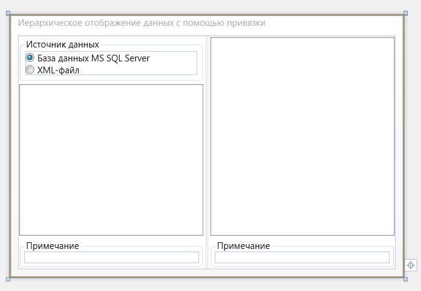

10. Добавляем в наш проект файл «XMLFile1.xml», который будет являться альтернативным источником данных:

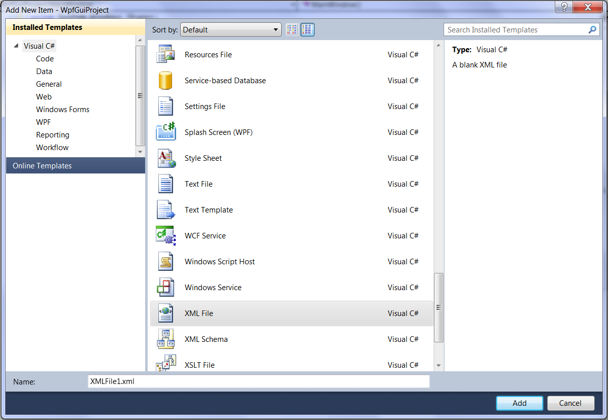

Наполняем созданный нами файл данными, прописанными в xml-формате:

```xml
<?xml version="1.0" encoding="utf-8" ?>
<MyXmlDocument>
 <Category CategoryName="Компьютерная литература" Description ="Различная литература по компьютерной тематике" ToolTipText="Мой раздел">
  <Category CategoryName="Windows-приложения" Description ="Данная ОС наиболее популярна" ToolTipText="Моя ось">
   <Category CategoryName="MS Office 2007" Description ="Офисный пакет программ" ToolTipText="Мой офис"/>
   <Category CategoryName="Продукция компании Autodesk" Description ="Различные САПР" ToolTipText="Мой выбор">
    <Category CategoryName="AutoCAD" Description ="Самый распространённый САПР" ToolTipText="Мой САПР">
     <Book BookName ="AutoCAD 2010. Полещук Н.Н." Description ="Моя книжка по данному САПР" ToolTipText="Справочник"/>
     <Book BookName ="AutoCAD 2007, библия пользователя. (автора не помню)" Description ="Ещё одна моя книжка по данному САПР" ToolTipText="Старая книга"/>
    </Category>
    <Category CategoryName="Revit" Description ="новое поколение САПР (BIM)" ToolTipText="Пока ещё не мой САПР"/>    
   </Category>
  </Category>
  <Category CategoryName="Linux-приложения" Description ="Свободно распространяемая ОС" ToolTipText="Интересно, но не сильно распространено"/>
 </Category>
 <Category CategoryName="Классика" Description ="Классическая литература" ToolTipText="Полезно для общего развития">
  <Category CategoryName="Повести и рассказы" Description ="Стихи отечественных авторов" ToolTipText="Для души">
   <Book BookName ="Капитанская дочка. А.С. Пушкин" Description ="Школьный курс" ToolTipText="Читал когда-то..."/>
  </Category>
  <Category CategoryName="Поэзия" Description ="Повести и рассказы отечественных авторов" ToolTipText="Это тоже для души"/>
 </Category> 
</MyXmlDocument>
```

11. Вносим изменения в файл «MainWindow.xaml.cs»:

```csharp
using System;
using System.Collections.Generic;
using System.Linq;
using System.Text;
using System.Windows;
using System.Windows.Controls;
using System.Windows.Data;
using System.Windows.Documents;
using System.Windows.Input;
using System.Windows.Media;
using System.Windows.Media.Imaging;
using System.Windows.Navigation;
using System.Windows.Shapes;
 
//Добавляем ссылки на нужные нам пространства имён
using Linq2Sql;
using System.Xml.Linq;
 
namespace WpfGuiProject
{
  /// <summary>
  /// Interaction logic for MainWindow.xaml
  /// </summary>
  public partial class MainWindow : Window
  {
    XElement xml;
    public MainWindow()
    {
      InitializeComponent();
      xml = XElement.Load(@"..\..\XMLFile1.xml");
    }
 
    //В этом методе заключается вся логика по указанию источника данных, которые следует отображать в окне
    private void Change_DataSource(object sender, RoutedEventArgs e)
    {
      if (rbDatabase.IsChecked == true) //В качестве источника данных выбрана база данных
      {
        listBooks.ItemTemplate = null;
        treeStructure.ItemsSource = new MyTestDbDataContext().Categories.Where(n => n.ParrentCategoryId == null);
        treeStructure.ItemTemplate = (HierarchicalDataTemplate)FindResource("key1");
        //Настраиваем привязку примечаний
        DescriptionBinding(selectedNodeDescription, "SelectedItem.Description", treeStructure);
        DescriptionBinding(selectedBookDescription, "SelectedItem.Description", listBooks);
        //Настраиваем привязку отображения книг
        Binding bind = new Binding("SelectedItem.Books") {Source = treeStructure };
        listBooks.SetBinding(ItemsControl.ItemsSourceProperty, bind);
      }
      else //В качестве источника данных выбран xml-файл
      {
        treeStructure.ItemsSource = xml.Elements("Category");
        treeStructure.ItemTemplate = (HierarchicalDataTemplate)FindResource("key2");
        //Настраиваем привязку примечаний
        DescriptionBinding(selectedNodeDescription, "SelectedItem.Attribute[Description].Value", treeStructure);
        DescriptionBinding(selectedBookDescription, "SelectedItem.Attribute[Description].Value", listBooks);
        //Настраиваем привязку отображения книг
        listBooks.ItemTemplate = (DataTemplate)FindResource("key3");
        Binding bind = new Binding("SelectedItem.Elements[Book]") { Source = treeStructure };
        listBooks.SetBinding(ItemsControl.ItemsSourceProperty, bind);
 
      }
    }
 
    /// <summary>
    /// Настройка привязки отображения данных
    /// </summary>
    /// <param name="textBlock">Текстовый объект, который должен отображать текст примечания</param>
    /// <param name="pathValue">значение Path привязки</param>
    /// <param name="source">ссылка на объект-источник, из которого считываются данные через свойство Path</param>
    void DescriptionBinding(TextBlock textBlock, string pathValue, Control source)
    {
      textBlock.SetBinding(TextBlock.TextProperty, new Binding(pathValue) { Source = source });
    }
  }
}
```

Теперь можно запускать наше приложение на исполнение и наслаждаться результатами работы… Итак жмём клавишу F5 и смотрим, что мы имеем…

### А. Источником является база данных:

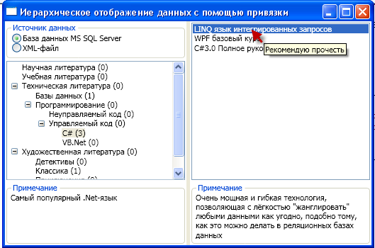

### Б. Источником является Xml-файл:

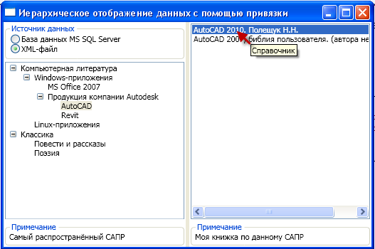

Исходный код решения (Solution) в формате MS Visual Studio 2010 можно скачать [здесь](media/TreeStructureBrowse.7z).