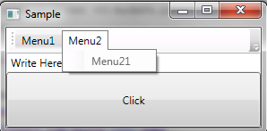

# WPF - MenuItem и важное свойство CommandTarget

Работает только с .NET Framework 3.5.

* Источник: <http://outcoldman.ru/ru/blog/show/148> \ 06.08.2009 00:12
* <zotero://attachment/7454/>

Предположим перед вами стоит простая задача – сделать Toolbar контрол, который будет отображаться на каждой странице и он так же будет состоять из меню. Один из вариантов – это разместить все необходимое на UserControl и размещать данный контор на каждом окне.

В нашем случае UserControl – это Toolbar с меню:

```xml
<UserControl x:Class="WpfApplicationMenuSample.MainUserControl" 
            xmlns="http://schemas.microsoft.com/winfx/2006/xaml/presentation" 
            xmlns:x="http://schemas.microsoft.com/winfx/2006/xaml" 
             x:Name="_this" > 
    <UserControl.Resources> 
        <RoutedCommand x:Key="MenuCommand" /> 
    </UserControl.Resources> 
    <UserControl.CommandBindings> 
        <CommandBinding Command="{StaticResource ResourceKey=MenuCommand}"  
                        Executed="MenuCommand_Executed"  
                        CanExecute="MenuCommand_CanExecute"/> 
    </UserControl.CommandBindings> 
    <ToolBar HorizontalAlignment="Stretch" > 
        <Menu> 
            <MenuItem Header="Menu1" > 
                <MenuItem CommandParameter="Menu11"  
                          Command="{StaticResource ResourceKey=MenuCommand}"  
                          Header="Menu11" /> 
            </MenuItem> 
            <MenuItem Header="Menu2" > 
                <MenuItem CommandParameter="Menu21"  
                          Command="{StaticResource ResourceKey=MenuCommand}"  
                          Header="Menu21" /> 
            </MenuItem> 
        </Menu> 
    </ToolBar> 
</UserControl>
```

В данном примере меню состоит из двух подменю, на которые привешена команда MenuCommand, методы команды простейшие:

```csharp
private void MenuCommand_Executed(object sender, ExecutedRoutedEventArgs e) 
{ 
    MessageBox.Show(e.Parameter.ToString()); 
} 
 
private void MenuCommand_CanExecute(object sender, CanExecuteRoutedEventArgs e) 
{ 
    e.CanExecute = true; 
}
```

То есть MenuCommand_CanExecute – гарантирует нам, что вызвать данное меню можно всегда, а MenuCommand_Executed – просто выполняет небольшую логику, просто для примера.

Следующие действие: кладем данный контрол на главное окно приложения:

```xml
<Window x:Class="WpfApplicationMenuSample.MainWindow" 
       xmlns="http://schemas.microsoft.com/winfx/2006/xaml/presentation" 
       xmlns:x="http://schemas.microsoft.com/winfx/2006/xaml" 
       xmlns:WpfApplicationMenuSample="clr-namespace:WpfApplicationMenuSample" 
        Title="Sample" Height="150" Width="300"> 
    <DockPanel> 
        <WpfApplicationMenuSample:MainUserControl DockPanel.Dock="Top"/> 
        <DockPanel> 
            <TextBox DockPanel.Dock="Top"/> 
            <Button >Click</Button> 
        </DockPanel> 
    </DockPanel> 
</Window>
```

Итак, в окне мы разместили наш MainUserControl, а так же поле для ввода и кнопку для примера. После запуска мы видим, что все работает, до того момента, пока мы не перевели фокус в TextBox или не нажали на кнопку Click, после этого мы видим, что MenuItem стали неактивными:



Догадаться, почему пункты меню стали не активными – сложно, но можно. Нужно обратить внимание на свойство [MenuItem.CommandTarget](http://msdn.microsoft.com/ru-ru/library/system.windows.controls.menuitem.commandtarget.aspx):

> Свойство CommandTarget указывает элемент, где исполняется команда. Если CommandTarget не задано, команду получает элемент, на котором находится фокус клавиатуры.

А так как фокус находится на элементе TextBox, то вот и получается, что команда выполниться не может. Вообще какая-то странная логика. И, самое интересное, если разместить все то, что находится на UserControl в окно и там же описаться команду и биндинги команды, то все будет работать нормально.

А решить проблему можно указав CommandTarget (заметим, что UserControl имеет имя _this):

```xml
<MenuItem CommandParameter="Menu11" CommandTarget="{Binding ElementName=_this}" 
          Command="{StaticResource ResourceKey=MenuCommand}"  
          Header="Menu11" />
```

После этого все будет работать.
