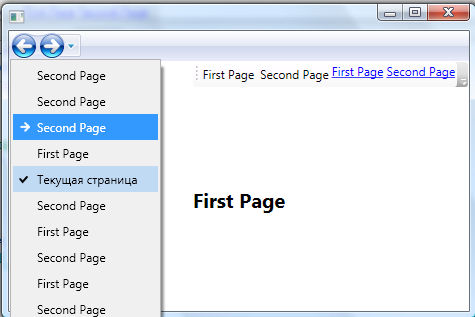
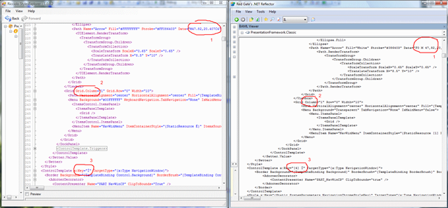
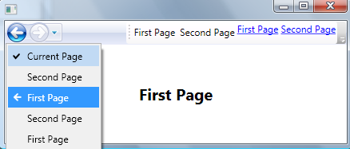

# WPF - использование навигации по страницам

Работает только с .NET Framework 3.5.

* Источник: <http://outcoldman.ru/ru/blog/show/149>\ 07.08.2009 00:12
* <zotero://attachment/7452/>

## WPF - использование навигации по страницам, добавление контролов в NavigationWindow

В WPF существует возможность создавать приложения с возможность навигации, то есть с использованием [Navigation](https://docs.microsoft.com/en-us/previous-versions/ms748811(v=vs.100)?redirectedfrom=MSDN) объектов, таких как [Page](http://msdn.microsoft.com/en-us/library/system.windows.controls.page.aspx), [NavigationService](http://msdn.microsoft.com/en-us/library/system.windows.navigation.navigationservice.aspx) и [NavigationWindow](http://msdn.microsoft.com/en-us/library/system.windows.navigation.navigationwindow.aspx). Большинство примеров на MSDN отображает, как использовать такие объекты в XBAP приложениях, но никто не запрещает нам и создавать клиентские приложения с использованием навигации по страницам.

Итак, постараемся создать такое приложение. Создаем новый WPF Application проект, оттуда удаляем созданное Window1.xaml, добавляем две страницы FirstPage.xaml и SecondPage.xaml, а так же прописываем в App.xaml файл страницу, с которой наше приложение будет стартовать:

```xml
StartupUri="FirstPage.xaml"
```

После запуска мы должны увидеть окно нашего приложения, содержащее навигационную панель с кнопками перехода вперед и назад. Дальше, нам необходимо создать ссылки, которые помогали бы переходить с одной страницы на другую. Это можно сделать разными способами.

Добавим в проект UserControl и назовем его ApplicationToolbar. Первая возможность, при помощи которой мы сможем осуществлять переход между страницами это использование [NavigationService](http://msdn.microsoft.com/en-us/library/system.windows.navigation.navigationservice.aspx), создадим для этого метод обработки нажатий на кнопки со следующим кодом:

```csharp
private void NavigationCommand_Executed(object sender, ExecutedRoutedEventArgs e) 
{ 
  NavigationService service = NavigationService.GetNavigationService(this); 
  service.Navigate(new Uri(e.Parameter.ToString(), UriKind.Relative)); 
}
```

Метод осуществляет переход на страницу, которая указана в параметрах команды. В xaml файле контрола ApplicationToolbar создадим команду, привяжем к ней данный метод и укажем кнопкам данную команду на выполнение:

```xml
<UserControl x:Class="WPF_NavigationWindow.ApplicationToolbar" xmlns="http://schemas.microsoft.com/winfx/2006/xaml/presentation" xmlns:x="http://schemas.microsoft.com/winfx/2006/xaml" Height="Auto" Width="Auto"> 
  <UserControl.Resources> 
    <!-- Команда для обработки нажатий клавиш --> 
    <RoutedCommand x:Key="NavigationCommand" /> 
  </UserControl.Resources> 
  <UserControl.CommandBindings> 
    <!-- Биндинг методов к команде --> 
    <CommandBinding Command="{StaticResource NavigationCommand}" Executed="NavigationCommand_Executed" /> 
  </UserControl.CommandBindings> 
  <ToolBar HorizontalAlignment="Right"> 
    <!-- Навигация по страницам осуществляется при помощи обычных кнопок и команд --> 
    <Button CommandParameter="FirstPage.xaml" Command="{StaticResource NavigationCommand}">First Page</Button> 
    <Button CommandParameter="SecondPage.xaml" Command="{StaticResource NavigationCommand}">Second Page</Button> 
  </ToolBar> 
</UserControl>
```

Таким образом мы создали панель с кнопками перехода между страницами. Можно пользоваться и более простым решением - [Hyperlink](http://msdn.microsoft.com/en-us/library/system.windows.documents.hyperlink.aspx), давайте добавим и его на наш контрол:

```xml
<ToolBarPanel> 
  <TextBlock> 
    <Hyperlink NavigateUri="FirstPage.xaml">First Page</Hyperlink> 
    <Hyperlink NavigateUri="SecondPage.xaml">Second Page</Hyperlink> 
  </TextBlock> 
</ToolBarPanel>
```

Итак, в результате мы должны получить, приблизительно, следующий вид окна:



Тут возникает следующее желание, положить наш контрол ApplicationToolbar на [NavigationWindow](http://msdn.microsoft.com/en-us/library/system.windows.navigation.navigationwindow.aspx) (там, где располагаются навигационные кнопки). Сделать нам это поможет возможность переопределение стилей в WPF. А именно переопределение стиля для [NavigationWindow](http://msdn.microsoft.com/en-us/library/system.windows.navigation.navigationwindow.aspx).

Для того, чтобы описать новый стиль для NavigationWindow, а точнее переписать существующий, нам изначально необходимо вытащить стиль из библиотек PresentationFramework. Вообще у PresentationFramework есть несколько наборов тем, таких как Classic, Aero, Royale и Luna, каждая тема лежит в отдельной библиотеке. Я буду рассматривать библиотеку PresentationFramework.Aero с ее темой. Для того, чтобы посмотреть BAML файл (после компиляции файл xaml упаковывается в baml - Binary Application Markup) можно воспользоваться программой [Reflector](http://www.red-gate.com/products/reflector/) с плагином [BamlViewer](http://www.codeplex.com/reflectoraddins), но как показала практика - BamlViewer не очень хорошо справляется с декомпиляцией: он не верно прописывает имена ключей (Key), не верно расшифровывает данные [Geometry](http://msdn.microsoft.com/en-us/library/ms751808.aspx), даже располагает описание триггеров перед описание контента стиля - из-за чего элементы в триггерах не находятся. В общем, лучше с задачей декомпиляции BAML справляется [StyleExplorer](http://www.codeplex.com/stylesexplorer). Вот небольшой скриншот сравнения данных программ:



Самое интересное, что значение ключей стилей действительно такими и являются как видно на скриншоте - x:Key="Ì". То есть в своих стилях мы можем ссылаться на стиль с именем ключа Ì (если стиль подключили). Почему сделаны такие странные имена ключей - не понятно (и видно так же, что BAML Viewer не верно их распознает). В итоге, Style Explorer предоставляет нам реально работающий XAML текст - мы можем к примеру перенести к себе в проект весь XAML текст и он будет валиден, чего не скажешь о BAML Viewer. Но весь XAML нам не нужен. Нам интересно переписать представление NavigationWindow, для этого мы изначально создадим в нашем проекте новый файл ресурсов Themes/General.xaml (имя файла и каталог можно выбрать любыми). Чтобы наш файл ресурсов был доступен в приложении - мы должны его так же подключить в файле App.xaml, это делается так:

```xml
<Application x:Class="WPF_NavigationWindow.App" xmlns="http://schemas.microsoft.com/winfx/2006/xaml/presentation" xmlns:x="http://schemas.microsoft.com/winfx/2006/xaml" StartupUri="FirstPage.xaml"> 
  <Application.Resources> 
    <ResourceDictionary> 
      <ResourceDictionary.MergedDictionaries> 
        <!-- Путь до нашего ресурса --> 
        <ResourceDictionary Source="Themes/General.xaml"/> 
      </ResourceDictionary.MergedDictionaries> 
    </ResourceDictionary> 
  </Application.Resources> 
</Application>
```

В файле General.xaml мы так же должны подключить файл ресурсов из библиотеки PresentationFramework.Aero, чтобы мы могли в стиле нашего будущего NavigationManager использовать уже существующие стили от темы Aero. Делается это таким же способом:

```xml
<ResourceDictionary.MergedDictionaries> 
  <ResourceDictionary Source="/PresentationFramework.Aero;V3.0.0.0;31bf3856ad364e35;component/themes/Aero.NormalColor.xaml"/> 
</ResourceDictionary.MergedDictionaries>
```

Далее из Style Explorer копируем стиль для NavigationWindow, а так же его ContentTemplate (который используется в стиле). ContentTemplate мы немного изменим, а точнее добавим наш контрол ApplicationToolbar в него, больше ничего делать не будем. Заметим, что ссылки на ресурсы вида ì, d, ê остаются и они будут работать. В результате у нас должен получится, приблизительно, такой набор стилей (большую часть закомментировал, там все остается то, что дал нам Style Explorer):

```xml
<ControlTemplate x:Key="d" TargetType="{x:Type NavigationWindow}"> 
  <Border Background="{TemplateBinding Control.Background}" BorderBrush="{TemplateBinding Control.BorderBrush}" BorderThickness="{TemplateBinding Control.BorderThickness}"> 
    <DockPanel> 
      <Grid Name="NavChrome" Background="{StaticResource e}" DockPanel.Dock="Top" Height="30"> 
        <Grid.ColumnDefinitions> 
          <ColumnDefinition Width="29" /> 
          <ColumnDefinition Width="26" /> 
          <ColumnDefinition Width="17" /> 
          <ColumnDefinition Width="*" /> 
        </Grid.ColumnDefinitions> 
        <!-- ... --> 
 
        <!-- Наш добавленный контрол --> 
        <WPF_NavigationWindow:ApplicationToolbar Grid.Row="0" Grid.Column="3" HorizontalAlignment="Right"/> 
      </Grid> 
 
      <!-- ... --> 
    </DockPanel> 
  </Border> 
  <ControlTemplate.Triggers> 
    <!-- ... --> 
  </ControlTemplate.Triggers> 
</ControlTemplate> 
 
<Style x:Key="{x:Type NavigationWindow}" TargetType="{x:Type NavigationWindow}"> 
  <!-- ... --> 
</Style>
```

В результате наше приложение будет выглядеть следующим образом:



Как видим, мы добились того, что наш контрол ApplicationToolbar теперь располагается на навигационной панели.
